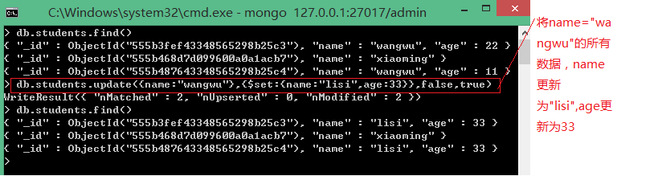
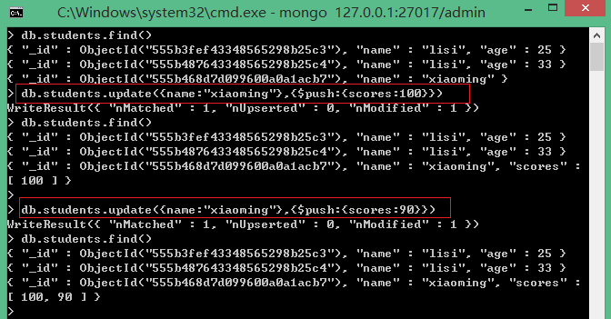

### 1.拉取官方镜像
```
docker pull mongo
```

### 2.运行容器
```
docke run -p 27017:27017 -v $PWD/db:/data/db -d mongo
```
命令说明：
- -d是后台运行(如果不后台运行，要想对mongo进行操作，就要重新打开一个终端)
- -p 27017:27017 :将容器的27017 端口映射到主机的27017 端口
- -v $PWD/db:/data/db :将主机中当前目录下的db挂载到容器的/data/db，作为mongo数据存储目录


### 3.查看容器的启动情况
```
docker ps
```

### 4.查看当前容器的IP地址
```
docker inspect <容器ID>
```

### 5.使用mongo镜像执行mongo 命令连接到刚启动的容器的主机IP
```
docker run -it mongo  mongo --host 172.17.0.1
```

### 6.查看数据库
```
show dbs
```

### 7.查看集合
```
show collections
```

#### 8.使用数据库
```
use <数据库名称>
```
如果没有这个数据库，就会自己创建一个新的数据库。新创建的数据库要想显示，需要向数据库中插入一条数据。

### 9.向一个集合中插入一条数据
```
db.students.insert({'name':'小明','age':20,'sex':'男'})
```
- 其中students是集合名称，instert是插入指令
- 输入 $db.students.find() 可以看到刚插入的一条数据


### 10.向数据库中删除一条数据（ 删除名字为小明的数据）
```
db.students.remove({'name':'小明'}) --- ({'name':'小明'}是删除的条件)
```

### 11.更改数据库中的一条数据(将小明的年龄改为18)
```
db.students.remove({'name':'小明'}) --- ({'name':'小明'}是删除的条件)
```

### 12.查找所有的数据
```
db.students.find()
```

### 13.查找年龄大于20的人
```
db.students.find({'age':{'$gt':20}})
```

### 14.update方法

update方法，顾名思义，就是当我执行该方法的时候，会首先根据该方法的查询条件进行查询，如果查询到了，则执行更新操作，如果没有查询到，则执行插入操作。
语法：db.集合名称.update({查询器},{修改器},true)
如果我利用update方法来更新数据的时候，如果此时有多条数据满足查询器，mongodb只会默认为我们更新第一条数据
如果我需要批量更新
可以这样写：
db.students.update({查询条件}，{$set:{更新数据}}，是否insertOrUpdate，是否批量更新)
可以看到这里用到了$set修改器。如下图:

  

### 15.mongodb的修改器

 


##### 15.1 $set：用来指定一个键值对，如果存在则修改，如果不存在则进行添加操作。如下图：
- 根据图片，我首先为name=”xiaoming”的更新一个age=44的数据，这个时候由于该条数据没有这个age键，所以会为该条数据添加age=44的键值对， 然而当我为name=”lisi”的数据设置age=25的时候，由于该条数据已经有了age这个键，所以会更新该键值对。
```
db.students.update({'name':'小明'},{$set:{'age':44}})
```
 


##### 15.2 $inc：用来为指定的键对应的数字类型的数值进行加减操作：
- 从图中，可以看出，我为name=”xiaoming”的这条数据，利用$inc修改器来将该条数据的age键的值+2，如果需要减去2，则填写-2即可。
```
db.students.update({'name':'小明'},{$inc:{'age':2}})
```
 


##### 15.3 $unset：删除指定的键：
- 我们将name=”xiaoming”的这条数据的age这个键成功去掉了。
```
db.students.update({'name':'小明'},{$unset:{'age':1}})
```
 


##### 15.4 $push修改器

$push修改器: （push的数据是一个数组，如果有这个键，就追加数据，如果没就创建一个新的，而set是一个字符串，并不是数组）
- 如果指定的键是数组，则追加新的数值。
- 如果指定的键不是数组，则中断当前操作。
- 如果不存在指定的键，则创建数组类型的键值对。
```
db.students.update({'name':'小明'},{$push:{'scores':100}})
```
 


##### 15.5 $addToSet修改器
- 当数组中存在需要添加的值，则什么都不做，如果数组中没有需要修改的值，则进行添加操作。
```
db.students.update({'name':'小明'},{$addToSet:{'scores':88}})
```
 


##### 15.6 $pop修改器  
- $pop修改器：从指定的数组中删除一个值：1表示最后一个值，-1表示第一个值。
```
db.students.update({'name':'小明'},{$pop:{'fruits':1}})
```
 


##### 15.7 $pull修改器
- $pull修改器：用来删除一个指定的数值
```
db.students.update({'name':'小明'},{$pull:{'fruits':'orange'}})
```
 


##### 15.8 $pullAll修改器
- $pullAll修改器：用来删除数组中所有的数据
```
db.students.update({'name':'小明'},{$pullAll:{'fruits':['apple','water']}})
```
 


##### 15.9 addToSet和each
- addToSet和each结合完成批量更新数组 （向一个数组里追加数据。）
```
db.students.update({'name':'小明'},{$addToSet:{'books':{$each:['red','green','blue']}}})
```
 
